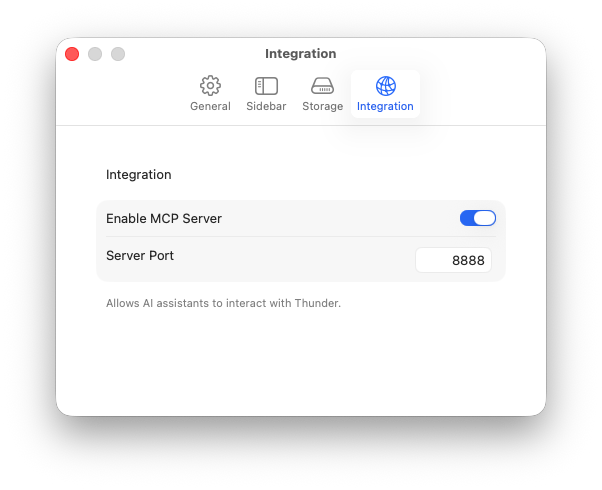

# Thunder

Gerenciador de arquivos para macOS escrito em Swift com SwiftUI.


> **Nota:** este projeto iniciou como um repositório privado com o nome **Thunar** usado provisoriamente durante o desenvolvimento inicial.
>
> Inspirado no Thunar do XFCE, sem qualquer vínculo com o projeto original.

## Funcionalidades

- Navegação com abas
- Modo lista e modo ícones
- Arrastar e soltar (Drag and Drop) de arquivos e pastas com suporte a seleção múltipla
- Copiar, recortar e colar
- Renomeação inteligente e segura:
  - Divisão vertical clara entre o nome base do arquivo e sua extensão
  - Proteção ativa com cadeado para evitar alterações ou exclusões acidentais da extensão
  - Formatação rápida de texto para **TUDO MAIÚSCULO**, **tudo minúsculo** ou **Primeira Letra Maiúscula**
- Comprimir arquivos e pastas com suporte a múltiplos formatos (**ZIP**, **TAR.GZ** e **TAR.BZ2**)
- Rotacionar e redimensionar imagens nativamente (com opção de aplicar no arquivo original ou criar uma cópia modificada)
- Gestão rápida de privilégios de execução (chmod +x/-x) e execução interativa de scripts (como .sh, .py, .js e .command) no Terminal pelo menu de contexto
- Quick Look (barra de espaço)
- Etiquetas coloridas (compatível com Finder)
- Mostrar/ocultar arquivos ocultos
- Abrir no Terminal
- Painel de armazenamento inteligente nos Ajustes que monitora em tempo real o espaço total, utilizado e disponível de todos os discos internos e externos conectados no Mac
- Suporte a múltiplos idiomas (Português, Inglês e Espanhol)

> [!TIP]
> **Nota sobre Execução de Scripts:** Para que scripts interpretados (como Python `.py` ou Node.js `.js`) sejam executados corretamente através do menu de contexto do Thunder (que os abre de forma interativa no Terminal), eles **precisam** conter a instrução **Shebang** na primeiríssima linha (ex: `#!/usr/bin/env python3` ou `#!/usr/bin/env node`) e ter permissão de execução ativa (`chmod +x`). Sem a shebang, o terminal do macOS tentará rodar o código usando o interpretador do shell padrão (`zsh` ou `bash`), gerando erros de sintaxe (como `syntax error near unexpected token '('` no Python).

## Integração MCP (IA) 🤖



O Thunder possui um servidor embutido do protocolo **MCP (Model Context Protocol)** na porta 8888 (desativado por padrão). Quando ativado nos Ajustes do aplicativo, ele roda de forma silenciosa via Server-Sent Events e atua como uma ponte de **leitura de contexto e navegação visual**, permitindo que assistentes de IA (como Antigravity, Claude Desktop, Cursor e Windsurf) entendam exatamente o que você está visualizando na interface gráfica.

> **Importante:** Por questões de segurança, o MCP do Thunder **não** possui ferramentas de exclusão permanente destrutiva. Ações de descarte são mapeadas exclusivamente para a Lixeira nativa do macOS (`trash_items`), o que garante a segurança dos seus dados contra acidentes!

**Ferramentas MCP disponíveis nativamente no Thunder:**
- **Ler o contexto e metadados da UI:**
  - `get_active_tab_path`: Retorna o caminho absoluto do diretório aberto na aba ativa.
  - `get_selected_files`: Retorna a lista de caminhos absolutos dos arquivos atualmente selecionados.
  - `list_directory_contents`: Lista detalhadamente os arquivos, tamanhos, datas e tags do diretório informado ou da aba ativa.
  - `get_file_metadata`: Fornece metadados detalhados (tamanho formatado, datas ISO8601, estado oculto, se é imagem ou arquivo protegido).
- **Navegação remota:**
  - `open_in_thunder`: Navega visualmente na interface gráfica para uma pasta ou arquivo específico.
- **Ações e manipulações nativas:**
  - `move_files` / `rename_item`: Move arquivos em lote ou renomeia itens com atualização visual instantânea da UI.
  - `create_file` / `create_folder`: Cria arquivos ou diretórios vazios na aba ativa atual.
  - `compress_items` / `decompress_item`: Compacta múltiplos arquivos (ZIP/TAR.GZ) ou descompacta arquivos suportados na UI.
  - `rotate_image` / `resize_image`: Executa operações nativas de rotação (90°, 180°, 270°) e redimensionamento de imagens (em pixels ou %) usando CoreImage e CoreGraphics no macOS.
  - `trash_items`: Move uma lista de arquivos de forma segura para a Lixeira do macOS com mensagens de status localizadas na UI.

## Instalação via Homebrew 🍺

Se você utiliza o [Homebrew](https://brew.sh/), pode instalar o Thunder de forma extremamente simples com um único comando no terminal:

```bash
brew install carlosxfelipe/tap/thunder
```

## Requisitos

- macOS 14.0 (Sonoma) ou superior
- Xcode 15 ou superior

## Como rodar

```bash
git clone https://github.com/carlosxfelipe/thunar.git
cd thunar
open thunar.xcodeproj
```

No Xcode, selecione o target `thunar` e clique em Run (Cmd+R).

## Testes Automatizados

O projeto inclui uma suíte de testes unitários super rápida para garantir a estabilidade das operações centrais do gerenciador de arquivos (criação de pastas/arquivos, proteção contra duplicatas, renomeação, exclusão permanente e a pilha de histórico de navegação). 

Para rodar todos os testes pelo terminal, utilize o script:

```bash
./scripts/run_tests.sh
```

## Build de distribuição (.dmg)

Para gerar um instalador no estilo "arraste para a pasta Aplicativos":

```
./scripts/build-dmg.sh
```

O arquivo `Thunder.dmg` será criado na raiz do projeto.

> **Aviso de Gatekeeper**: como o app não é assinado com Apple Developer ID, ao abrir pela primeira vez o macOS pode exibir *"Thunder não pôde ser aberto porque o desenvolvedor não pode ser verificado"* ou *"Thunder está danificado"*. Para contornar, escolha uma das opções abaixo.

### Opção A — Botão direito (recomendado)

1. Arraste o `Thunder.app` para `/Aplicativos`.
2. Clique com o **botão direito** sobre o app → **Abrir**.
3. No diálogo, clique em **Abrir** novamente.

A partir daí o macOS lembra a permissão.

### Opção B — Remover o atributo de quarentena pelo Terminal

Se aparecer "está danificado", rode:

```
xattr -cr /Applications/Thunder.app
```

Depois é só abrir normalmente.

## Acesso à Lixeira e pastas protegidas

Para acessar a Lixeira ou outras pastas protegidas pelo macOS, conceda **Acesso Total ao Disco** ao `Thunder` em:

```
Ajustes do Sistema > Privacidade e Segurança > Acesso Total ao Disco
```

Se o acesso continuar negado mesmo depois de ativar a permissão, feche o app, remova o `Thunder` da lista, adicione novamente o app instalado em `/Applications` e abra o app de novo.

Em alguns casos, pode ser necessário resetar a permissão do macOS com:

```
tccutil reset SystemPolicyAllFiles com.example.thunder
```

Depois do reset, adicione o `Thunder` novamente em **Acesso Total ao Disco**.

## Atalhos de teclado

| Atalho | Ação |
|---|---|
| Cmd+C | Copiar |
| Cmd+X | Recortar |
| Cmd+V | Colar |
| Cmd+A | Selecionar tudo |
| Cmd+T | Nova aba |
| Cmd+W | Fechar aba |
| Ctrl+Tab | Próxima aba |
| Ctrl+Shift+Tab | Aba anterior |
| Space | Quick Look |
| Enter | Abrir item (modo ícones) |
| Setas | Navegar entre itens (modo ícones) |
| Shift+Setas | Seleção múltipla (modo ícones) |
| Shift+Clique | Seleção em bloco (modo ícones) |
| Cmd+Clique | Seleção individual |
| Cmd+Shift+. | Mostrar/ocultar arquivos ocultos |
| Cmd+Shift+G | Ir para Pasta... |
| Cmd+F | Focar no campo de busca |
| Esc | Limpar busca / Cancelar diálogos |
| Cmd+, | Abrir Preferências |
| Letras/Números | Saltar para item pelo nome |

## Idiomas

O Thunder oferece suporte nativo a:

- **Português (Brasil)**
- **English**
- **Español**

O idioma pode ser alterado nas **Preferências (Cmd+,)**, na aba **Geral**. Por padrão, o aplicativo tenta seguir o idioma definido no sistema macOS.

## Licença

Copyright (C) 2026 Carlos Felipe Araújo

Distribuído sob a licença **GNU General Public License v3.0** (GPLv3).
Consulte o arquivo [`LICENSE`](LICENSE) para mais detalhes.
