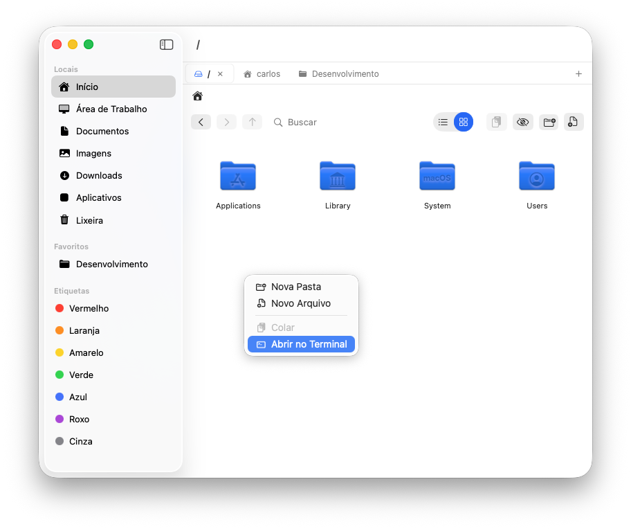

# Thunder

Gerenciador de arquivos para macOS escrito em Swift com SwiftUI.



> **Nota:** este projeto iniciou como um repositório privado com o nome **Thunar** usado provisoriamente durante o desenvolvimento inicial.
>
> Inspirado no Thunar do XFCE, sem qualquer vínculo com o projeto original.

## Funcionalidades

- Navegação com abas
- Modo lista e modo ícones
- Arrastar e soltar (Drag and Drop) de arquivos e pastas com suporte a seleção múltipla
- Copiar, recortar e colar
- Renomeação inteligente e segura:
  - Divisão vertical clara entre o nome base do arquivo e sua extensão
  - Proteção ativa com cadeado para evitar alterações ou exclusões acidentais da extensão
  - Formatação rápida de texto para **TUDO MAIÚSCULO**, **tudo minúsculo** ou **Primeira Letra Maiúscula**
- Comprimir arquivos e pastas com suporte a múltiplos formatos (**ZIP**, **TAR.GZ** e **TAR.BZ2**)
- Rotacionar e redimensionar imagens nativamente (com opção de aplicar no arquivo original ou criar uma cópia modificada)
- Quick Look (barra de espaço)
- Etiquetas coloridas (compatível com Finder)
- Mostrar/ocultar arquivos ocultos
- Abrir no Terminal
- Suporte a múltiplos idiomas (Português, Inglês e Espanhol)

## Requisitos

- macOS 14.0 (Sonoma) ou superior
- Xcode 15 ou superior

## Como rodar

```
git clone https://github.com/carlosxfelipe/thunar.git
cd thunar
open thunar.xcodeproj
```

No Xcode, selecione o target `thunar` e clique em Run (Cmd+R).

## Build de distribuição (.dmg)

Para gerar um instalador no estilo "arraste para a pasta Aplicativos":

```
./scripts/build-dmg.sh
```

O arquivo `Thunder.dmg` será criado na raiz do projeto.

> **Aviso de Gatekeeper**: como o app não é assinado com Apple Developer ID, ao abrir pela primeira vez o macOS pode exibir *"Thunder não pôde ser aberto porque o desenvolvedor não pode ser verificado"* ou *"Thunder está danificado"*. Para contornar, escolha uma das opções abaixo.

### Opção A — Botão direito (recomendado)

1. Arraste o `Thunder.app` para `/Aplicativos`.
2. Clique com o **botão direito** sobre o app → **Abrir**.
3. No diálogo, clique em **Abrir** novamente.

A partir daí o macOS lembra a permissão.

### Opção B — Remover o atributo de quarentena pelo Terminal

Se aparecer "está danificado", rode:

```
xattr -cr /Applications/Thunder.app
```

Depois é só abrir normalmente.

## Acesso à Lixeira e pastas protegidas

Para acessar a Lixeira ou outras pastas protegidas pelo macOS, conceda **Acesso Total ao Disco** ao `Thunder` em:

```
Ajustes do Sistema > Privacidade e Segurança > Acesso Total ao Disco
```

Se o acesso continuar negado mesmo depois de ativar a permissão, feche o app, remova o `Thunder` da lista, adicione novamente o app instalado em `/Applications` e abra o app de novo.

Em alguns casos, pode ser necessário resetar a permissão do macOS com:

```
tccutil reset SystemPolicyAllFiles com.example.thunder
```

Depois do reset, adicione o `Thunder` novamente em **Acesso Total ao Disco**.

## Atalhos de teclado

| Atalho | Ação |
|---|---|
| Cmd+C | Copiar |
| Cmd+X | Recortar |
| Cmd+V | Colar |
| Cmd+A | Selecionar tudo |
| Cmd+T | Nova aba |
| Cmd+W | Fechar aba |
| Ctrl+Tab | Próxima aba |
| Ctrl+Shift+Tab | Aba anterior |
| Space | Quick Look |
| Enter | Abrir item (modo ícones) |
| Setas | Navegar entre itens (modo ícones) |
| Shift+Setas | Seleção múltipla (modo ícones) |
| Shift+Clique | Seleção em bloco (modo ícones) |
| Cmd+Clique | Seleção individual |
| Cmd+Shift+. | Mostrar/ocultar arquivos ocultos |
| Cmd+F | Focar no campo de busca |
| Esc | Limpar busca / Cancelar diálogos |
| Cmd+, | Abrir Preferências |
| Letras/Números | Saltar para item pelo nome |

## Idiomas

O Thunder oferece suporte nativo a:

- **Português (Brasil)**
- **English**
- **Español**

O idioma pode ser alterado nas **Preferências (Cmd+,)**, na aba **Geral**. Por padrão, o aplicativo tenta seguir o idioma definido no sistema macOS.

## Licença

Copyright (C) 2026 Carlos Felipe Araújo

Distribuído sob a licença **GNU General Public License v3.0** (GPLv3).
Consulte o arquivo [`LICENSE`](LICENSE) para mais detalhes.
