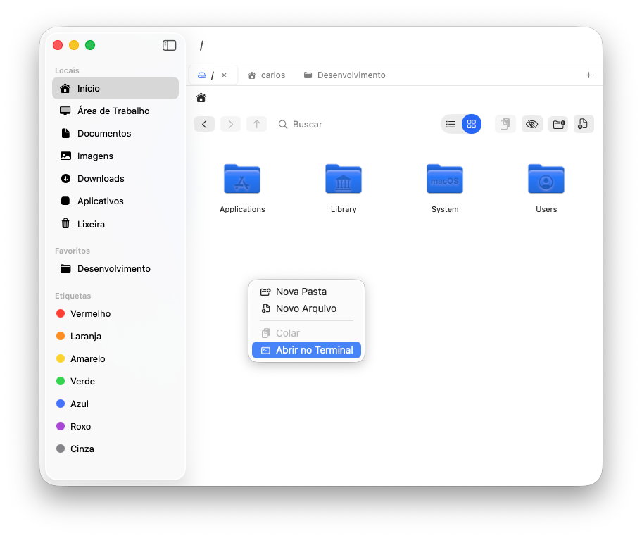

# Thunder

macOS file manager written in Swift with SwiftUI.



> **Note:** this project started as a private repository with the name **Thunar** used provisionally during initial development.
>
> Inspired by XFCE's Thunar, without any link to the original project.

## Features

- Tabbed navigation
- List mode and icon mode
- Drag and Drop for files and folders with multiple selection support
- Copy, cut, and paste
- Smart and secure renaming:
  - Clear vertical division between the file's base name and its extension
  - Active lock protection to prevent accidental changes or deletion of the extension
  - Quick text formatting for **ALL CAPS**, **all lowercase** or **Capitalize First Letter**
- Compress files and folders with support for multiple formats (**ZIP**, **TAR.GZ** and **TAR.BZ2**)
- Natively rotate and resize images (with the option to apply to the original file or create a modified copy)
- Quick management of execution privileges (chmod +x/-x) and interactive execution of scripts (like .sh, .py, .js, .ts, and .command) in the Terminal via context menu
- Quick Look (space bar)
- Colored tags (Finder compatible)
- Show/hide hidden files
- Open in Terminal
- Smart storage panel in Settings that monitors total, used, and available space of all internal and connected external drives on the Mac in real-time
- Multi-language support (Portuguese, English, and Spanish)

> [!TIP]
> **Script Execution (Python, JS, TS):**
> 1. **Requirements:** Must contain the **Shebang** on the very first line (e.g., `#!/usr/bin/env bun` or `#!/usr/bin/env python3`) and active execution permission (`chmod +x`).
> 2. **macOS Privacy:** The Terminal inherits the app's permissions. To avoid silent permission failures, Thunder hides the execution option in protected folders (Desktop, Documents, Downloads). Always execute your scripts from free directories (e.g., `/Users/your-user/Development`).

## Installation via Homebrew 🍺

If you use [Homebrew](https://brew.sh/), you can install Thunder very easily with a single terminal command:

```bash
brew install carlosxfelipe/tap/thunder
```

## Requirements

- macOS 14.0 (Sonoma) or higher
- Xcode 15 or higher

## How to run

```bash
git clone https://github.com/carlosxfelipe/thunar.git
cd thunar
open thunar.xcodeproj
```

In Xcode, select the `thunar` target and click Run (Cmd+R).

## Automated Tests

The project includes a super-fast unit test suite to ensure the stability of the core file manager operations (folder/file creation, duplicate protection, renaming, permanent deletion, and navigation history stack). 

To run all tests via terminal, use the script:

```bash
./scripts/run_tests.sh
```

## Distribution Build (.dmg)

To generate a "drag to Applications folder" style installer:

```bash
./scripts/build-dmg.sh
```

The `Thunder.dmg` file will be created in the project root.

> **Gatekeeper Warning**: since the app is not signed with an Apple Developer ID, upon opening for the first time macOS may display *"Thunder cannot be opened because the developer cannot be verified"* or *"Thunder is damaged"*. To bypass this, choose one of the options below.

### Option A — Right-click (recommended)

1. Drag `Thunder.app` to `/Applications`.
2. **Right-click** on the app → **Open**.
3. In the dialog, click **Open** again.

From then on, macOS remembers the permission.

### Option B — Remove quarantine attribute via Terminal

If "is damaged" appears, run:

```bash
xattr -cr /Applications/Thunder.app
```

Then just open it normally.

## Trash and protected folders access

To access the Trash or other macOS protected folders, grant **Full Disk Access** to `Thunder` in:

```
System Settings > Privacy & Security > Full Disk Access
```

If access remains denied even after enabling the permission, close the app, remove `Thunder` from the list, add the installed app in `/Applications` again, and reopen the app.

In some cases, it may be necessary to reset the macOS permission with:

```bash
tccutil reset SystemPolicyAllFiles com.example.thunder
```

After the reset, add `Thunder` back to **Full Disk Access**.

## Keyboard shortcuts

| Shortcut | Action |
|---|---|
| Cmd+C | Copy |
| Cmd+X | Cut |
| Cmd+V | Paste |
| Cmd+A | Select all |
| Cmd+T | New tab |
| Cmd+W | Close tab |
| Ctrl+Tab | Next tab |
| Ctrl+Shift+Tab | Previous tab |
| Space | Quick Look |
| Enter | Open item (icon mode) |
| Arrows | Navigate between items (icon mode) |
| Shift+Arrows | Multiple selection (icon mode) |
| Shift+Click | Block selection (icon mode) |
| Cmd+Click | Individual selection |
| Cmd+Shift+. | Show/hide hidden files |
| Cmd+Shift+G | Go to Folder... |
| Cmd+F | Focus search field |
| Esc | Clear search / Cancel dialogs |
| Cmd+, | Open Preferences |
| Letters/Numbers | Jump to item by name |

## Languages

Thunder natively supports:

- **Português (Brasil)**
- **English**
- **Español**

The language can be changed in **Preferences (Cmd+,)**, under the **General** tab. By default, the application tries to follow the system language defined in macOS.

## License

Copyright (C) 2026 Carlos Felipe Araújo

Distributed under the **GNU General Public License v3.0** (GPLv3).
See the [`LICENSE`](LICENSE) file for more details.
